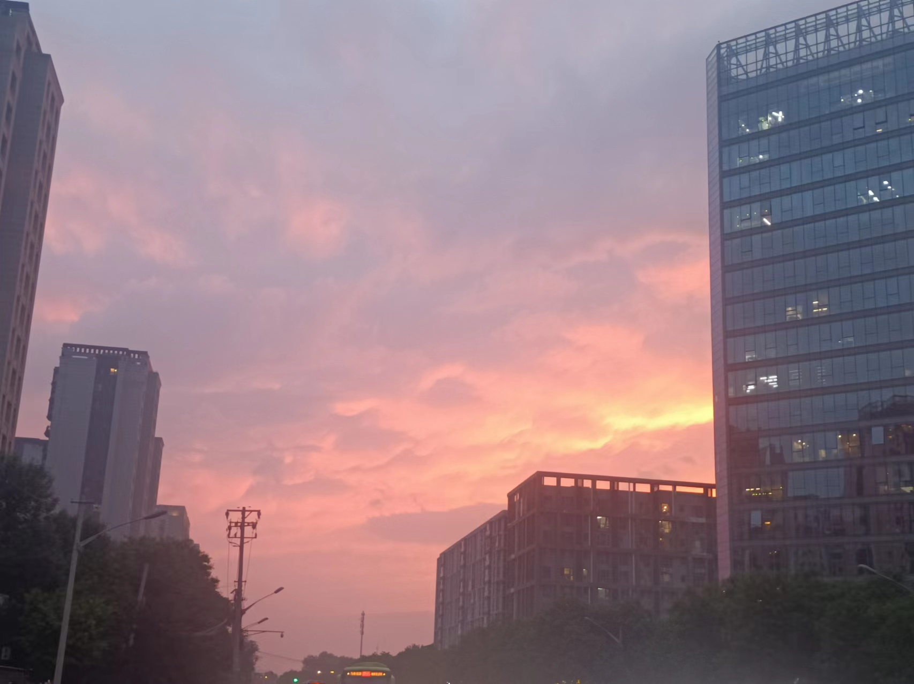

最近一周发生了很多很多事情。

时光匆匆如雨，上周，摸鱼了三周没活后来了新任务，虽然只是让看看项目，但由于太久没干活了，还是好好看了下想好好写下文档。

上周没什么面试，只有一个滴滴，面了两轮，第二轮感觉还可以，但是现在没有反馈应该是寄了，基础忘记了好多，手写节流和 watch 的原理都没说出来，没过也正常了。

还是有点点后悔没去美团或者当时没有把 base 改成北京再来个复活赛。不过也无所谓了。

<!-- 上周二下午突然收到一条短信，她问我有没有在学校，想加回我，我同意了。 -->

<!-- 这周三学校正好体测回去了一趟，周二晚上和她见面了，当时想着直接买个花表白了，成了就成不成就算了，反正是她来找的我。见面聊天时已经完全没有高中时候最初的感觉了，就像平平常常的女生而已。最后只是聊了一些近况就准备走了，也没有表白的冲动了，但走之前想到花买都买了，试一下她的想法究竟是怎样吧。结果她没有同意，她还是想做好朋友。我拒绝了，第二天发了一段话之后就拉黑了。

山高路远，过去的人，过去的事，早就该烟消云散，如果不是美好的回忆，就没有什么值得留念的。早就该结束形同陌路的人，我之前硬是为了高中时候的执念做了一年多的朋友让自己纠结，徒增的只有许多内耗。 -->

昨天晚上回来之前去大一一个关系很好的朋友宿舍待了一会，在他那玩了一会植物大战僵尸，看他的生活，还是那么云淡风轻，似乎并不把什么事情太在意。我大一很喜欢和他玩，每天在一块逃课，打游戏。他头脑聪明，豁达，乐观，是我在大学里很少很少见到的人了。

五一仿佛放过去，五月就已经过去了一半。这半个月，希望学点技术，一定保持能每天至少写一道算法，无论多忙。

马上 13 周了，还有两周快考试了，从明天开始每天晚上要学一个小时学校的课程。

之前学了两天的英语又半途而废了，重新学一下。

万千世界，多学习，多体验。

