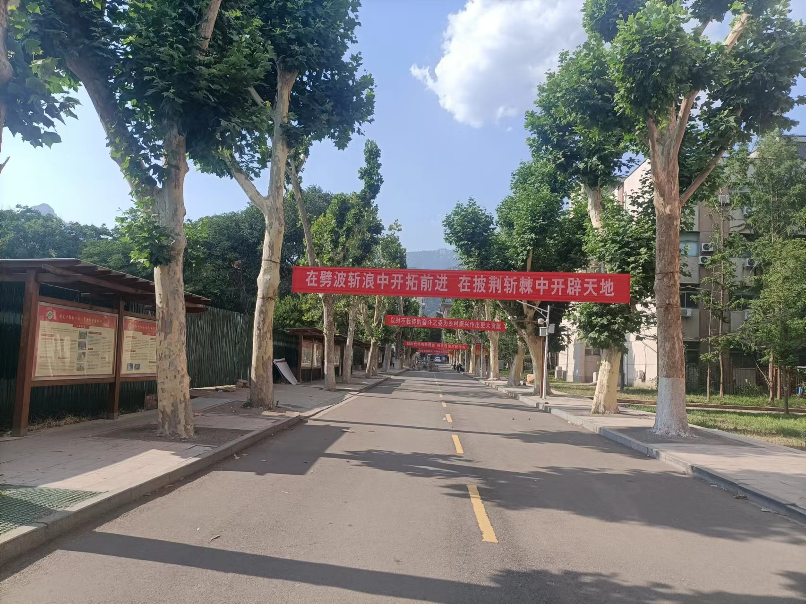

又过去了一个月，这一个月感觉过的迷迷糊糊的，也忙完了不少事情，但是没有留下什么印象也没有留下什么收获，都像转瞬即逝一样。

还有两周学期就结束了。

最近看毕业季，逛跳蚤市场，感觉离自己近了许多，似乎看到了自己走的样子。

大学四年，无论风光得意，无论成功上岸，无论失意难安，走过的就是四年，留下的徒有回忆，看过的春暖花开，在图书馆和宿舍度过的春夏秋冬，只剩这些。

少年只需再努力一些，让离开后的道路更好走一点，走的不那么艰难。

六月过一半了，希望能坚持多学学东西，多刷刷力扣，期末考完，安心工作，少摸鱼，多看看文档，多学学技术，没事多出去走走。两个月很快就过去。

转眼回来就是秋招，至此大学已经接近尾声了。

像高三一样，再努力一下好吧，这么年轻，应该再拼搏一下，让起点高一点，加油。

雁过留声一样，大学四年能留下点什么记忆

