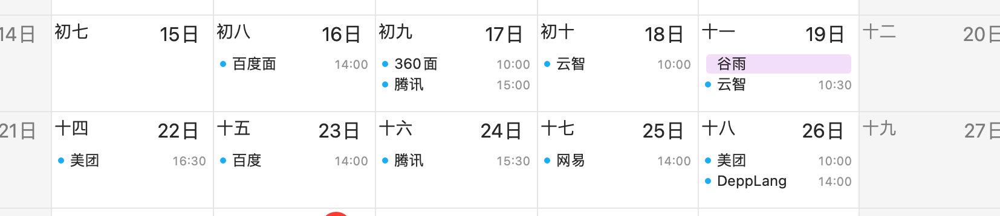
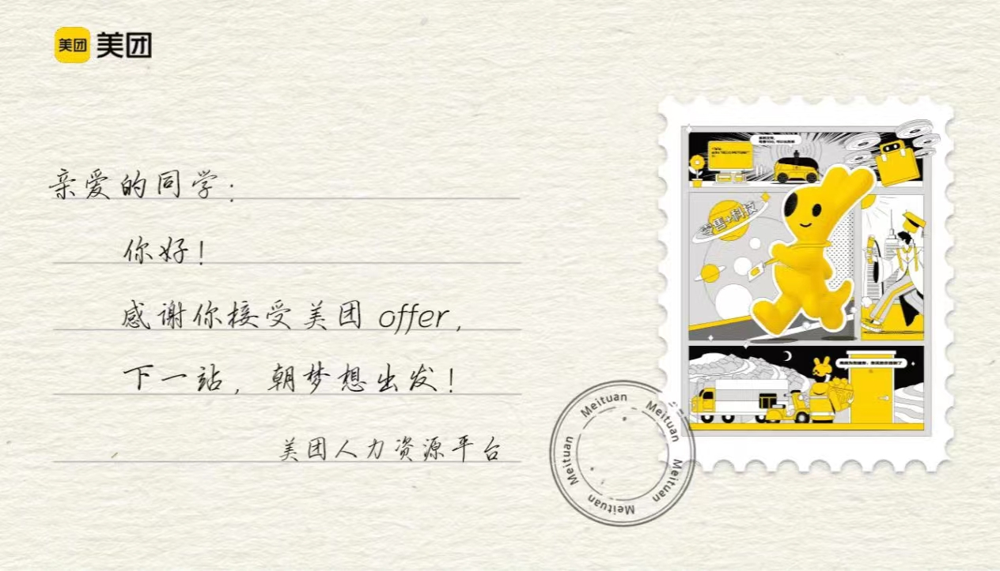
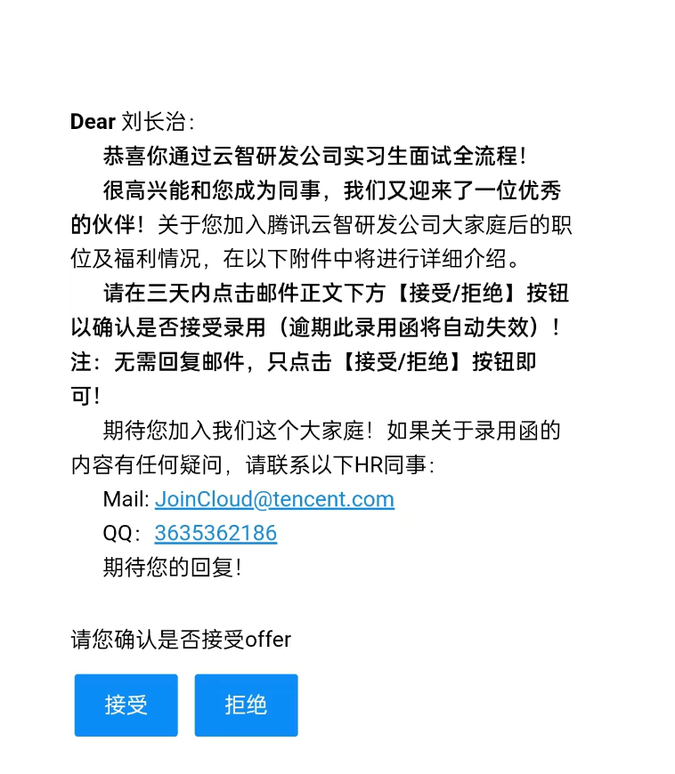

最难过的一集

四月份投半个多月简历加面试，最后同时拿到了两个 offer，一个云智，一个美团，直接准备去美团暑期转正就把云智直接拒了，

接了美团的第二天想和家里人商量一下，没想到父母直接强烈反对不让去，最后非常难受把美团拒了。

这半个多月，哎，没什么意思，如此而已

明天正好是五一假期了。

还是算了，陪家玩几天，回来再着吧。

昨天和朋友打电话，聊着，我讲到，一年前的时候，我也想着，如果毕业以后考个教资直接会老家当个历史老师，直接在县城安安逸逸，多好，甚至我高考前还有这个想法。

到后来大二大三，然后出来实习，走了多一点的路，想法很快变了，觉得年轻人应该多走一点路，想去香港新加坡工作，所以美团一面完面试官问能不能接受 base 成都，我毫不犹豫就说可以。二十多岁也是没毕业的孩子，也是父母担心的孩子。哎
